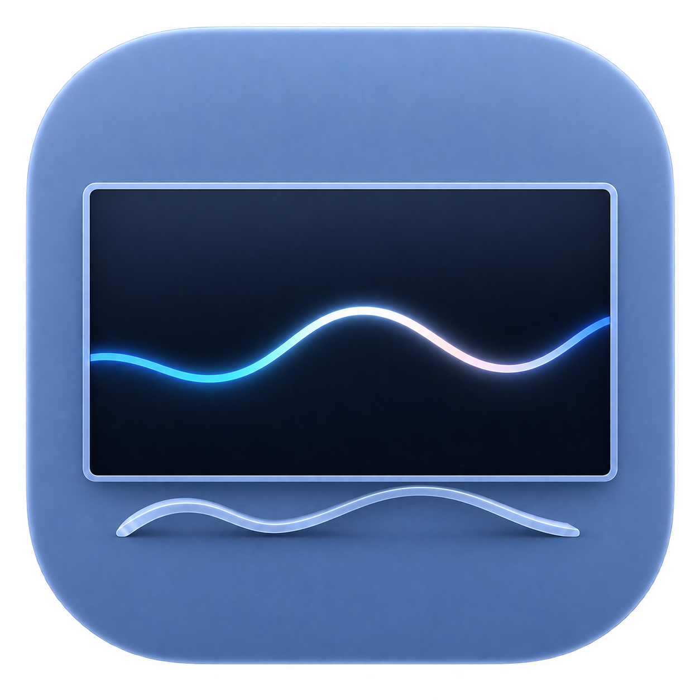

<h1 align="center">Right Display</h1>

<strong>Display status and everyday controls for your Mac’s external displays.</strong> See resolution, refresh rate, HDR and color output, with common controls in the menu bar.

<a href="https://github.com/RedoRosetta/RightDisplay/releases/download/v0.4-beta-rc/RightDisplay-0.4-Beta-RC-arm64.zip"><strong>Download 0.4 Beta RC</strong></a> · <a href="INSTALLATION.md#english">Install</a> · <a href="releases/0.4-beta-rc.md#english">Release notes</a> · <a href="https://github.com/RedoRosetta/RightDisplay/issues/new/choose">Feedback</a> · <a href="README.md">简体中文</a>

macOS 14+ · Apple silicon Macs (no Intel build) · Public release candidate

> **Before downloading:** This RC is not Apple notarized and may need confirmation at first launch. **Virtual Audio software volume has a known distribution issue, may not start, and requires macOS 27+. If HDMI / DP software volume is your main need, we recommend waiting for a fix.** [Known issues and installation](INSTALLATION.md#english)

*0.4 interface preview. The device, 120 Hz and 12-bit values reflect the setup at capture time, not support for every connection or verified behavior of this RC. The interface supports Simplified Chinese and English; most preview images show Chinese.*

## Understand the state before changing it

When you wonder why 120 Hz is missing, whether HDR is active, or why an advertised mode is not in use, Right Display brings the relevant information together:

- **See the state:** resolution, HiDPI, refresh rate, HDR, RGB / YCbCr, color depth and output range.
- **Make adjustments:** choose modes available on the current connection and access common display, brightness and volume controls from the menu bar.
- **Investigate:** inspect EDID capabilities and ICC color profiles, and export diagnostics locally when needed.

**Display capabilities, current macOS reports and inferred information are identified separately.** An EDID claim of HDR support does not mean HDR is active; DSC remains labeled as inferred. A system report is not a physical measurement at the display receiver.

## Everyday controls in the menu bar

Click the Right Display menu-bar icon to open Quick Control. Choose which brightness, volume, color format, depth, HDR and VRR controls appear in General; availability depends on the device and connection.

Quick Control shares state with the full window. Brightness requires a control exposed by macOS; volume requires support from the selected device or audio path. A slider in the preview does not mean every HDMI device has directly adjustable volume.

## Adjust display output

Use Display to select resolution, HiDPI, fixed refresh rates or VRR, and the color-output combinations provided by the system.

Right Display uses modes macOS provides for the current connection, preserves timing differences such as `120 Hz / 119.88 Hz`, and handles color format, depth, range and HDR as a complete combination. It reads the system state again after changes.

Once configured, Configuration Protection helps prevent accidental display changes while leaving brightness and volume available. Changes requiring confirmation offer a countdown and attempt to restore the previous configuration if unconfirmed. **Switching may temporarily blank the screen; recovery is not guaranteed.** Display Link Test is an optional troubleshooting tool, not a first-use requirement.

## ICC and EDID: color and device capabilities

**ICC color profiles:** inspect the current profile or an external ICC file, apply an available profile after confirmation, and view white point, primaries, tone curves, gamut relationships and VCGT calibration data.

ICC plots describe the file’s model, not a measured screen gamut or proof of the calibration currently loaded by the GPU. Opening a file for inspection does not automatically apply it.

View the EDID page

EDID organizes advertised resolution, HDR, refresh-rate and VRR capabilities, with raw-data export. **Advertised capabilities are not current output state.** Exports may include serial numbers; review before sharing.

## Audio: Apple TV and optional Virtual Audio

Audio supports outputs whose volume macOS allows you to adjust, plus compatible Apple TV output volume and supported keyboard controls. Apple TV may require local-network access and pairing. HomePod can follow that path when used as Apple TV’s current or default audio output; this is not direct control of every HomePod or AirPlay speaker.

**Virtual Audio is a separate, optional path:** forward system audio to a selected HDMI / DisplayPort output and adjust software volume, without changing the TV or monitor’s hardware volume.

> **Do not rely on Virtual Audio in this RC.** Component signature checks conflict with this ad-hoc distribution and may prevent forwarding. Cross-machine installation and actual playback of this public package have not yet been fully verified. This issue concerns the virtual-audio path; display, ICC, EDID and Apple TV features do not require installing it. The component requires macOS 27+. See the [installation guide](INSTALLATION.md#english).

View the Virtual Audio preview and audio path

**System audio → Right Display Virtual Audio → software volume → selected HDMI / DP output**

*This is a 0.4 interface preview. Its active-forwarding indicator does not establish that this RC works.*

The feature is designed to save a real output target, start when conditions allow, preserve manual stops and offer explicit recovery after abnormal stops. Selecting its volume control does not change macOS’s default output; an unavailable target does not automatically fall back to Mac speakers. A ready status still needs confirmation through actual playback.

## Download, install and get started

1. Download [RightDisplay-0.4-Beta-RC-arm64.zip](https://github.com/RedoRosetta/RightDisplay/releases/download/v0.4-beta-rc/RightDisplay-0.4-Beta-RC-arm64.zip). This is the app package; GitHub’s automatically generated **Source code** archives are not installable apps.
2. Extract it, drag `Right Display.app` to Applications, and open it there. Before upgrading, quit the old copy normally and keep a backup.
3. This RC is ad-hoc signed and not Apple notarized. If macOS cannot verify the developer or check the app, confirm that it came from this repository, then follow **System Settings → Privacy & Security → Open Anyway** where offered.
4. Click the menu-bar icon and inspect your current display before making changes. **Neither Virtual Audio installation nor Display Link Test is required.**

There is no need to disable Gatekeeper or SIP. [Full installation, permissions, troubleshooting and removal guide](INSTALLATION.md#english) · [Release page and checksum](https://github.com/RedoRosetta/RightDisplay/releases/tag/v0.4-beta-rc)

## General settings and diagnostics

The full window has Overview, Display, Audio, ICC, EDID and General pages. General controls language, login behavior, Quick Control items and automatic-correction options.

View General settings in English

Safe Mode suppresses automatic display correction at launch, connection changes and wake. Configuration Protection restricts manual display adjustments.

Diagnostic reports are saved locally only when you request them and are not automatically uploaded. Review device names, serial numbers, network information and paths before sharing. [Privacy](PRIVACY.md)

## Beta and feedback

0.4 Beta RC is a public test candidate, **not the final 0.4 Beta**. This phase focuses on real-world feedback, clear blockers and the Virtual Audio distribution issue.

[Report a problem or ask a question](https://github.com/RedoRosetta/RightDisplay/issues/new/choose) with the app version, Mac and macOS version, what happened and what you expected. Intermittent issues are welcome; you do not need to know every display parameter. A GitHub account is required to submit, and attachments should be reviewed for private information.

[0.4 release notes](releases/0.4-beta-rc.md#english) · [Version history](CHANGELOG.md) · [Security](SECURITY.md)

## Support development

If Right Display helps you, you are welcome to support its development voluntarily. Using it, testing it and sharing feedback are equally welcome.

<table align="center">
<tr><th>Alipay</th><th>WeChat Pay</th></tr>
<tr><td align="center"></td><td align="center"></td></tr>
</table>

If these payment methods are unavailable to you, feedback is another way to help.

This repository provides downloads, documentation and public distribution materials; the app’s proprietary source is not published here. [NOTICE](NOTICE.md) · [Third-party licenses](THIRD_PARTY_LICENSES.md)
