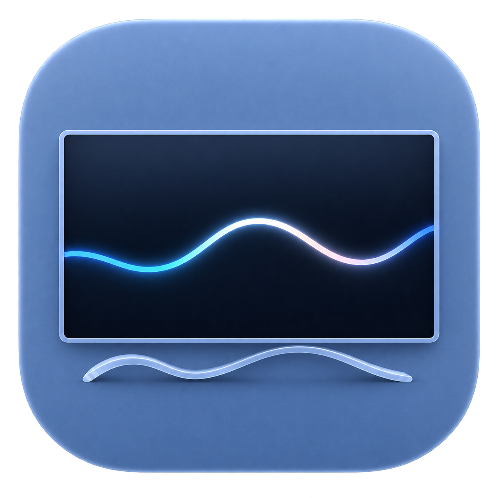
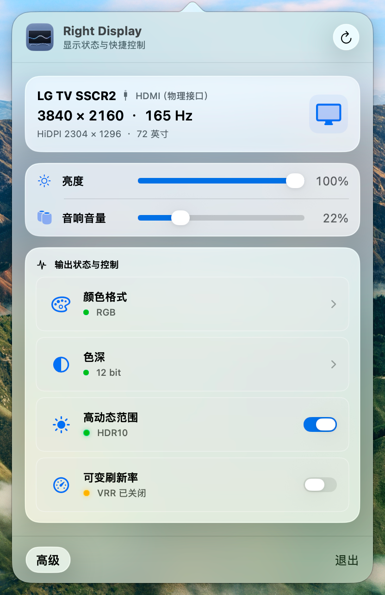
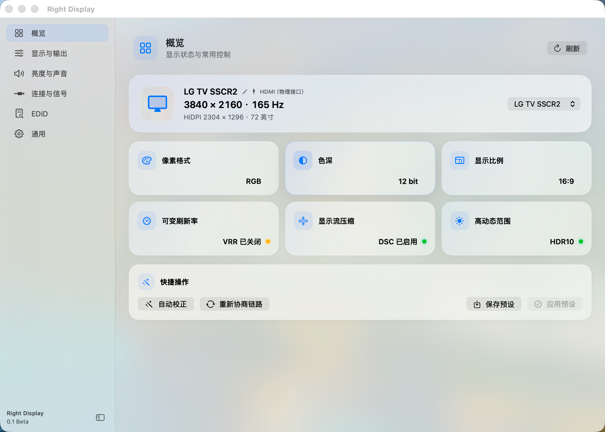
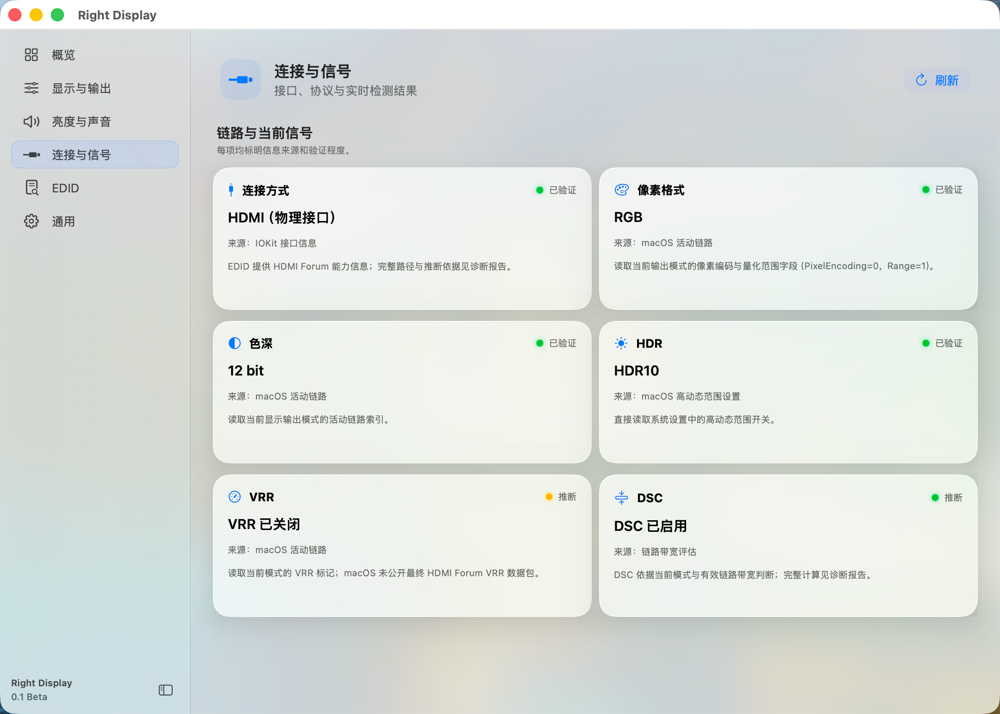
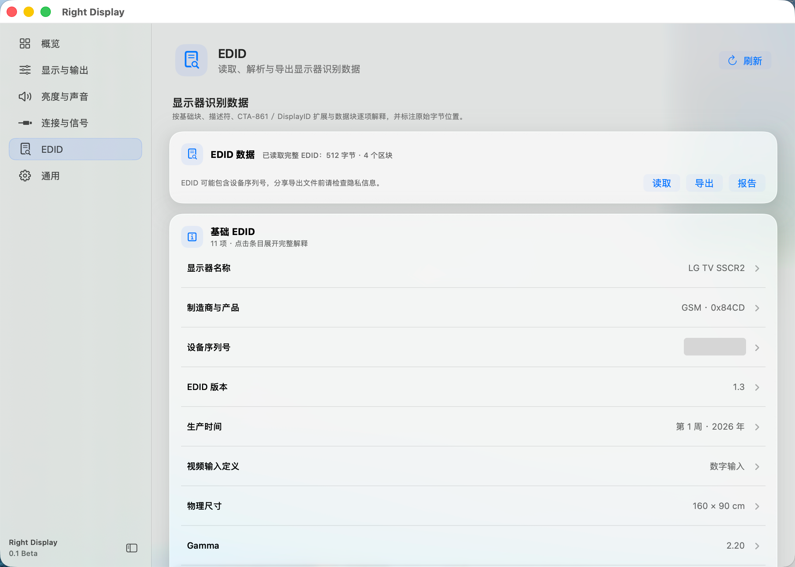

# Right Display｜正确显示

**Right Display（正确显示）** 是一款用于查看并调整 Mac 实际显示输出的实用工具。

**Right Display** is a utility for inspecting and adjusting the actual display output produced by your Mac.

它可以帮助你看清 Mac **到底在输出什么**：从物理输出分辨率、HiDPI 逻辑分辨率、渲染尺寸，到刷新率、VRR、HDR、DSC、RGB / YCbCr、色深以及 EDID 等显示链路信息，并提供相应的显示调整与高级功能。

It helps you see **what your Mac is actually outputting**, including physical output resolution, HiDPI logical resolution, render size, refresh rate, VRR, HDR, DSC, RGB / YCbCr, color depth, EDID, and other display-link information, together with related display adjustments and advanced features.

  

目前经过实际测试，Right Display 已可以在 **Mac mini（M4）+ LG G6 + Apple TV 4K（Gen 3）+ HomePod（Gen 2）** 的组合中识别并调整 RGB、12 Bit、165 Hz 和 HDR 等显示状态，同时调节显示器亮度以及通过 eARC 连接的 HomePod 设备音量，并实现与 Mac 键盘音量快捷键的联动。

Right Display has been tested with a **Mac mini (M4) + LG G6 + Apple TV 4K (Gen 3) + HomePod (Gen 2)** setup. In this configuration, it can identify and adjust display states such as RGB, 12-bit color, 165 Hz, and HDR, control display brightness and the volume of a HomePod connected through eARC, and link Apple TV volume control to the Mac keyboard volume keys.

此外，Redmi G27 Pro U 显示器也已经完成测试，可以正确切换至 RGB 模式，解决与 Mac 连接的兼容性问题。

The Redmi G27 Pro U monitor has also been tested and can be switched correctly to RGB mode, resolving a compatibility issue when connected to a Mac.

这是一个早期测试版本。测试显示模式切换前，请记录当前可用的显示设置。

This is an early beta release. Before testing display-mode changes, record your current working display settings.

## 下载 / Download

请从 [Right Display 0.2 Beta Release 页面](https://github.com/RedoRosetta/RightDisplay/releases/tag/RightDisplay0.2Beta) 下载 **Right-Display-0.2-Beta.zip**。

Download **Right-Display-0.2-Beta.zip** from the [Right Display 0.2 Beta Release page](https://github.com/RedoRosetta/RightDisplay/releases/tag/RightDisplay0.2Beta).

SHA-256：**11b9bfa5e22d208834d73e49f27947a85c9ed6fb25d20a792c3c2496ea27ec33**

Release 页面同时提供 Apple TV helper 重建材料，以及 zeroconf 0.150.0 的精确对应源码。

The Release page also provides the Apple TV helper rebuild materials and the exact corresponding source archive for zeroconf 0.150.0.

## 0.2 Beta 更新重点 / 0.2 Beta Highlights

- 新增“跟随系统 / 简体中文 / English”界面语言选择，并默认跟随系统。
  Added Follow System, Simplified Chinese, and English interface-language options, with Follow System as the default.
- 优化英文界面的窗口、侧边栏、快捷面板和控件排版，并补齐 EDID、连接信号及音频状态等动态内容的英文显示。
  Improved English layouts across windows, sidebars, the quick panel, and controls, and completed English localization for dynamic EDID, connection-signal, and audio-status content.
- 将 Apple TV“重新搜索”升级为完整“重新连接”，可在锁屏或休眠后重建音量控制连接。
  Upgraded Apple TV Search Again to a full Reconnect that can rebuild the volume-control connection after screen lock or sleep.
- 重新连接后会恢复已保存设备，并重新读取连接状态与当前音量；连续重连也会清理旧 helper 和失效运行时资源。
  Reconnect restores the saved device and refreshes its connection status and current volume, while repeated reconnects clean up the previous helper and stale runtime resources.

## 主要功能 / Main Features

- 通告当前的物理输出分辨率、HiDPI 逻辑分辨率和显示链路信号状态。
  Reports the current physical output resolution, HiDPI logical resolution, and display-link signal state.
- 通告当前 HDR/SDR、VRR、DSC 启用状态，读取 RGB、YCbCr 信号信息，并提供相应控制。
  Reports HDR/SDR, VRR, and DSC state, reads RGB and YCbCr signal information, and provides related controls.
- 在 macOS 提供可写接口时控制显示器亮度。
  Controls display brightness when macOS exposes a writable interface.
- 通过可写音频接口提供 Apple TV/HomePod 兼容音量控制。
  Provides Apple TV/HomePod-compatible volume control through writable audio interfaces.
- 读取、解析并导出显示器 EDID 和显示诊断信息。
  Reads, parses, and exports display EDID and diagnostic information.
- 可启用 Mac 键盘原生音量快捷键，实现类原生的 Apple TV 音量调节。
  Can bind the Mac keyboard volume keys for native-like Apple TV volume adjustment.

## 软件截图 / Screenshots

  

## 兼容性与系统要求 / Compatibility and Requirements

- macOS 14 或更高版本。
  macOS 14 or later.
- 当前安装包面向 Apple 芯片 Mac。
  The current package is built for Apple silicon Macs.
- 部分诊断和控制功能仅适用于外接显示器。
  Some diagnostic and control features apply only to external displays.
- 功能可用性取决于 Mac、macOS 版本、显示器、扩展坞或转接器、线材和连接方式。
  Feature availability depends on the Mac, macOS version, display, dock or adapter, cable, and connection path.
- 部分显示控制功能需要辅助功能权限。
  Some display-control features require Accessibility permission.
- Apple TV/HomePod 发现与控制需要本地网络权限。
  Apple TV/HomePod discovery and control require Local Network permission.

并非所有显示器都支持全部控制功能。当 macOS 无法提供可验证的数据时，Right Display 会显示不可用或推断结果。

Not every display supports every control. When macOS cannot provide verifiable data, Right Display reports the item as unavailable or inferred.

## 已知限制 / Known Limitations

- 许多 RGB/YCbCr 和色深组合由 macOS、驱动与显示器协商，无法保证每个请求组合都能被采用或持续生效。
  Many RGB/YCbCr and color-depth combinations are negotiated by macOS, the driver, and the display, so a requested combination cannot always be guaranteed or kept active.
- DSC 状态来自显示模式和链路带宽推断，并非直接从显示器接收端读取。
  DSC state is inferred from the display mode and link bandwidth rather than read directly from the display receiver.
- VRR、亮度、HDR、颜色格式、色深和音频行为会因硬件与连接链路而异。
  VRR, brightness, HDR, color format, color depth, and audio behavior vary by hardware and connection path.
- 当前 Beta 使用 ad-hoc 签名，没有 Apple Developer ID 签名，也未经过 Apple notarization。
  The current beta uses an ad-hoc signature and is neither signed with an Apple Developer ID nor notarized by Apple.

## 安装 / Installation

1. 下载并解压 **Right-Display-0.2-Beta.zip**。
   Download and extract **Right-Display-0.2-Beta.zip**.
2. 将 **Right Display.app** 移动到“应用程序”文件夹。
   Move **Right Display.app** to the Applications folder.
3. 打开应用。
   Open the app.
4. 如果 macOS 阻止首次启动，请打开 **系统设置 → 隐私与安全性**，找到 Right Display 并选择 **仍要打开（Open Anyway）**。
   If macOS blocks the first launch, open **System Settings → Privacy & Security**, find Right Display, and choose **Open Anyway**.
5. 仅在需要相关功能时授予辅助功能或本地网络权限。
   Grant Accessibility or Local Network permission only when the corresponding feature is needed.

## 反馈与 Issues / Feedback and Issues

请使用 [GitHub Issues](https://github.com/RedoRosetta/RightDisplay/issues)，并选择 Bug Report 模板。

Use [GitHub Issues](https://github.com/RedoRosetta/RightDisplay/issues) and select the Bug Report template.

请尽量提供 Mac 型号、macOS 版本、显示器型号、连接方式、分辨率、刷新率、HDR 状态、问题描述和重现步骤。如果条件允许，也可以提供 Right Display 诊断信息。

Please include the Mac model, macOS version, display model, connection method, resolution, refresh rate, HDR state, problem description, and reproduction steps. If possible, include Right Display diagnostic information.

诊断报告和 EDID 可能包含设备名称、序列号、显示器标识符、网络信息或其他个人信息。公开上传前请先检查并删除不希望公开的内容。不要发布密码、Token、Apple ID、配对凭据或其他敏感信息。

Diagnostic reports and EDID data may contain device names, serial numbers, display identifiers, network information, or other personal information. Review and remove anything you do not want to publish. Never post passwords, tokens, Apple IDs, pairing credentials, or other sensitive information.

## 第三方许可证 / Third-Party Licenses

用户安装包内包含所需的第三方许可证和 NOTICE。Apple TV/HomePod helper 重建包及对应源码材料可从 [Right Display 0.2 Beta Release 页面](https://github.com/RedoRosetta/RightDisplay/releases/tag/RightDisplay0.2Beta) 获取。

The installation package includes the required third-party licenses and NOTICE files. Apple TV/HomePod helper rebuild materials and corresponding source materials are available from the [Right Display 0.2 Beta Release page](https://github.com/RedoRosetta/RightDisplay/releases/tag/RightDisplay0.2Beta).

公开分发摘要见 [THIRD_PARTY_LICENSES.md](THIRD_PARTY_LICENSES.md)。

See [THIRD_PARTY_LICENSES.md](THIRD_PARTY_LICENSES.md) for the public-distribution summary.

## 源码公开范围 / Public Source Scope

Right Display 自有的 Swift 显示控制核心源码和私有 Xcode 工程未在本仓库公开。

Right Display's proprietary Swift display-control core and private Xcode project are not published in this repository.

为满足独立 Apple TV/HomePod helper 第三方许可证要求所需的源码和重建材料，已作为 Release Asset 提供。

The source and rebuild materials required to satisfy the licenses of the standalone Apple TV/HomePod helper are provided as Release assets.
