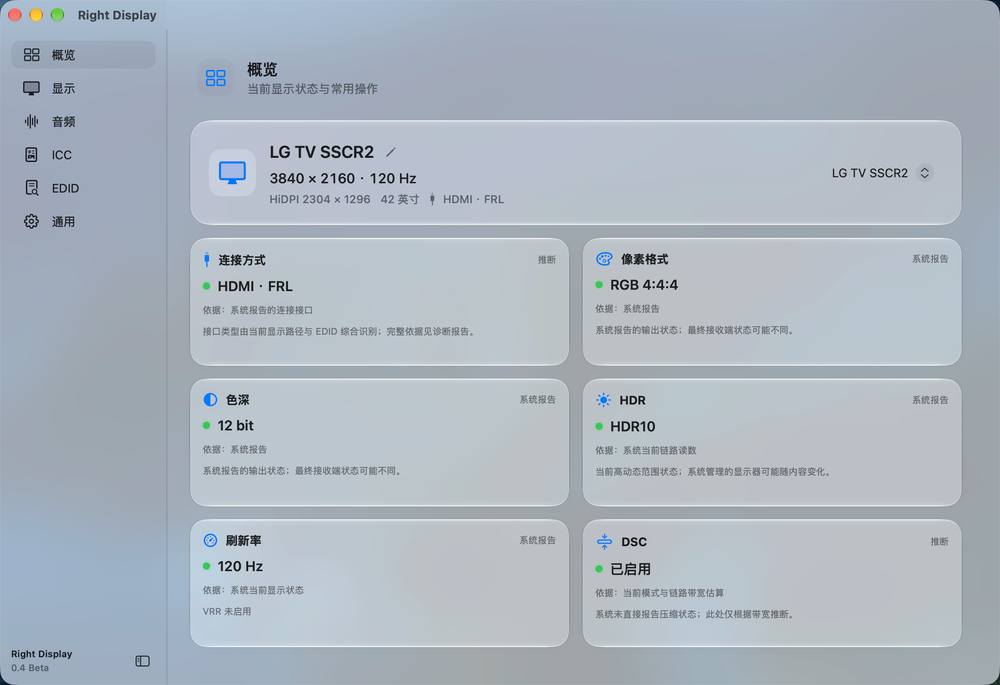
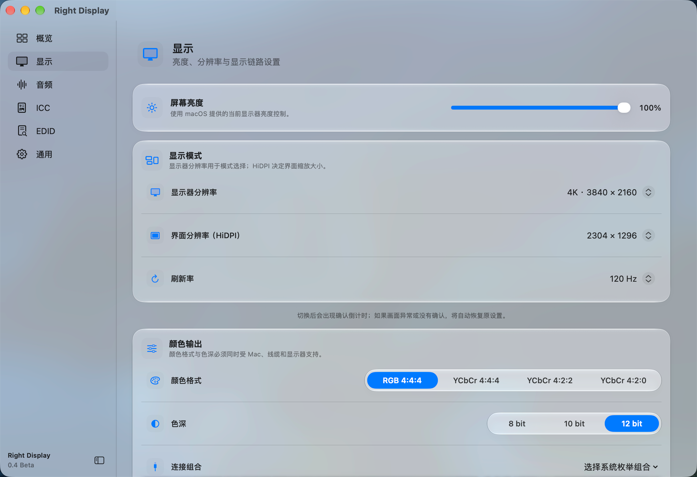
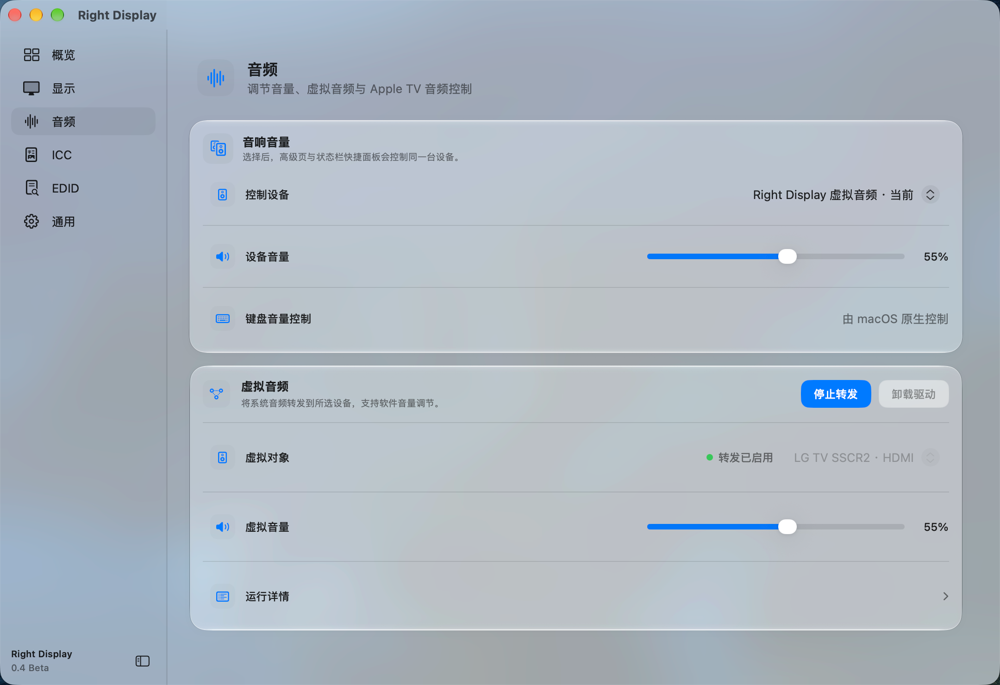
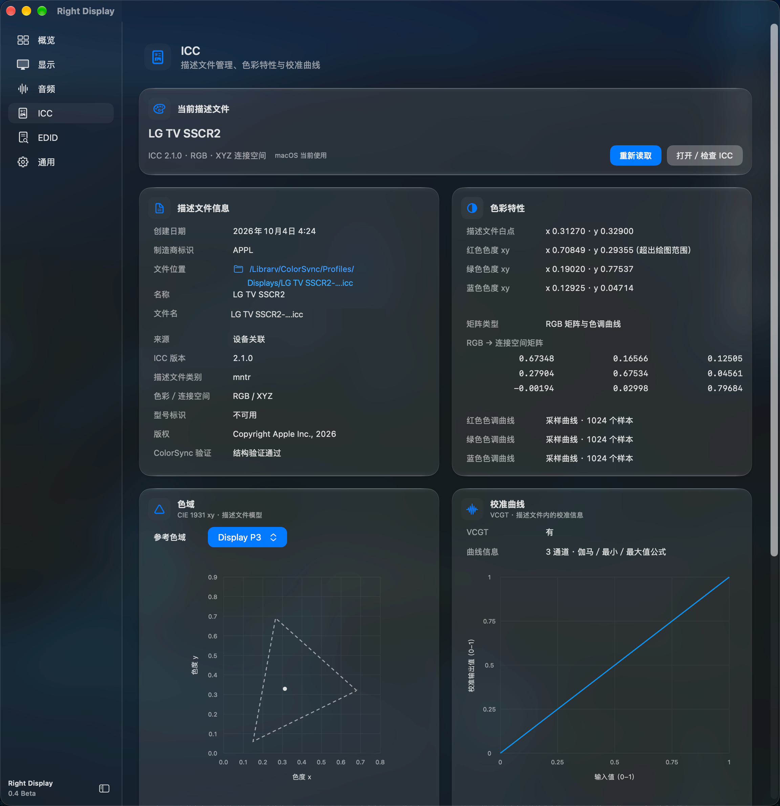
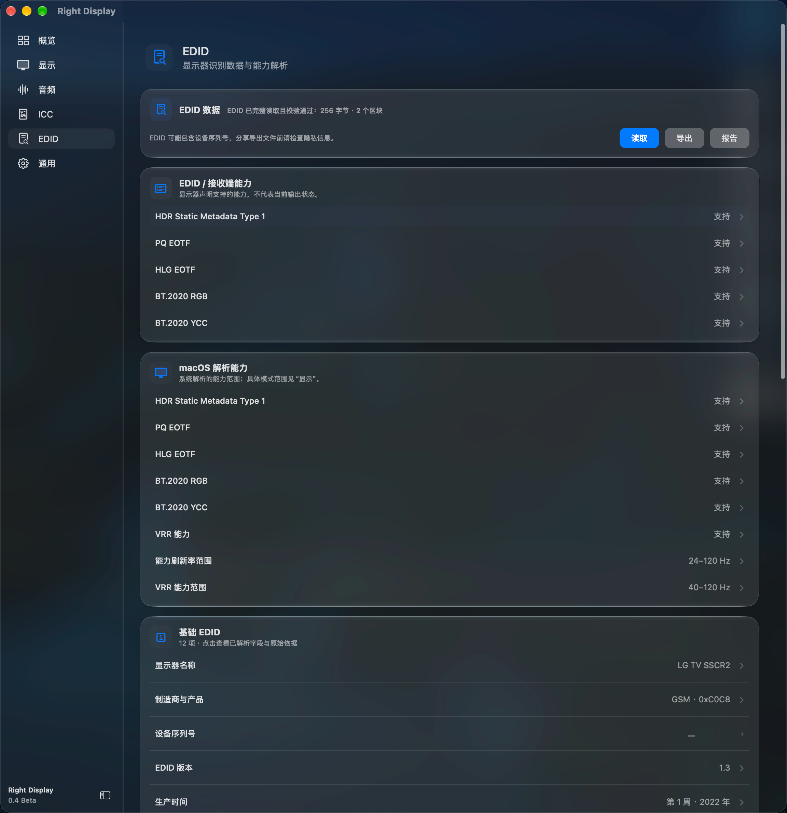
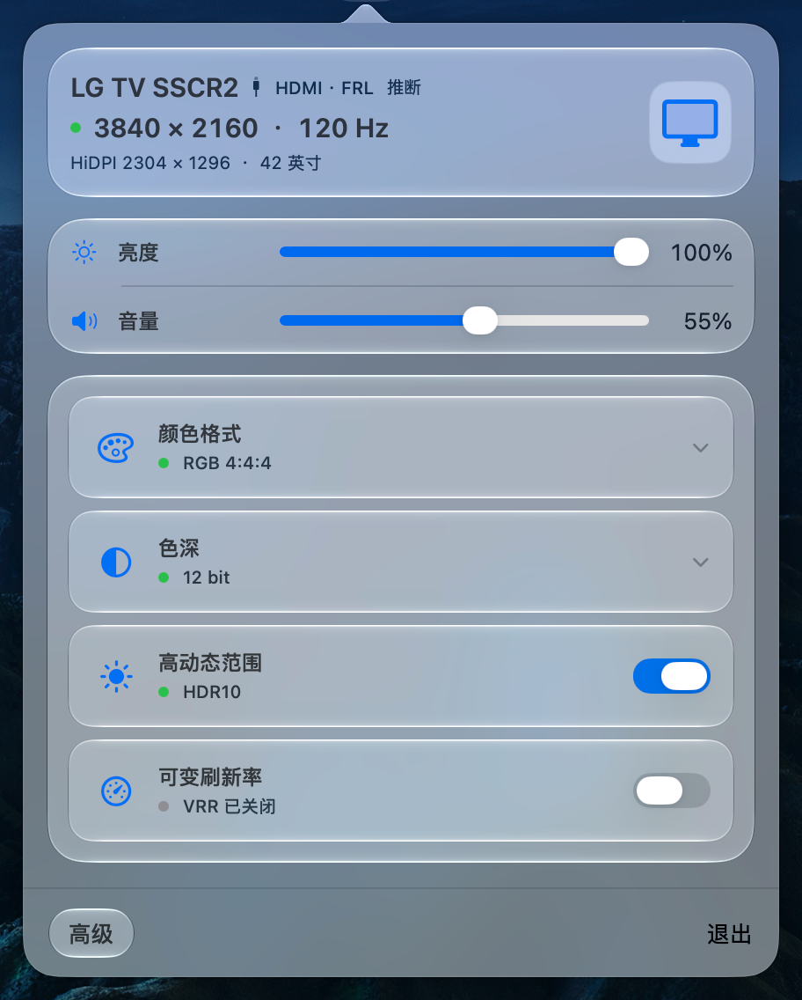
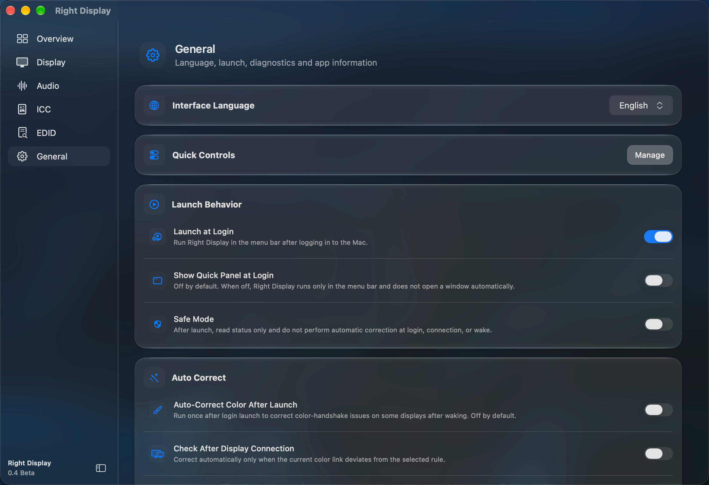

  

<h1 align="center">RightDisplay · 正确显示</h1>

  看清 Mac 正在输出什么，也把常用的显示与音频控制放在手边。

  <a href="https://github.com/RedoRosetta/RightDisplay/releases/tag/v0.4-beta-rc"><strong>下载 0.4 Beta RC</strong></a>
  · <a href="releases/0.4-beta-rc.md">更新说明</a>
  · <a href="README.en.md">English</a>
  · <a href="CHANGELOG.md">版本历史</a>

macOS · Apple silicon · arm64

## RightDisplay 是什么？

RightDisplay 是一款面向 Mac 外接显示器的状态栏工具。

macOS 能告诉你显示器“亮了”，但当你开始关心 4K 120 Hz、HiDPI、HDR、RGB / YCbCr、10 / 12-bit、VRR、ICC，或者 HDMI 音频为什么没有音量控制时，很多信息和设置会散落在系统的不同位置。

RightDisplay 把这些东西整理到了一起：

- 查看当前分辨率、HiDPI、刷新率、HDR 和颜色输出
- 在系统实际提供的模式之间进行切换
- 区分固定刷新率与 VRR
- 查看 RGB / YCbCr、色深和输出范围
- 读取 EDID，并区分设备能力与当前状态
- 查看和切换 ICC Color Profile
- 为部分 HDMI / DisplayPort 音频提供软件音量
- 控制支持的 Apple TV 音量
- 在快捷面板里访问常用设置
- 在显示切换异常时尝试恢复原来的配置

0.4 重新整理了完整窗口和快捷控制，也加入了 ICC 与 Virtual Audio。

  

## 当前到底在输出什么？

概览页把一条显示连接最常用的信息放在一起：

**分辨率 · HiDPI · 刷新率 · 连接 · 颜色格式 · 色深 · HDR · VRR · DSC**

这里有一个 RightDisplay 很在意的区别：

**显示器支持什么，macOS 报告什么，以及当前能够确认什么，并不是一回事。**

例如 EDID 可以声明显示器支持 HDR 或 VRR，但这不意味着当前连接正在使用它；macOS 返回的颜色组合适合用于设置和回读，也不应该被包装成接收端的物理测量结果。

RightDisplay 会尽量把这些信息的来源保留下来。能确认的就显示，只有推断依据的就标成推断，没有足够证据时保持未知。

## 调整显示输出

「显示」页集中管理当前显示器的主要输出设置：

- 分辨率
- HiDPI
- 固定刷新率与 VRR
- RGB / YCbCr
- 8 / 10 / 12-bit
- HDR

  

RightDisplay 使用 macOS 为当前连接实际提供的模式，不根据 EDID 凭空生成一个“理论上应该能用”的输出。

像 `120 Hz` 和 `119.88 Hz`、`60 Hz` 和 `59.94 Hz` 这样的系统时序也会分别保留；VRR 则作为独立模式显示。

颜色输出同样按照完整组合处理。例如：

`RGB · 12-bit · Full · HDR`

和

`YCbCr 4:4:4 · 10-bit · Limited · HDR`

是两种不同的连接状态，而不是几个互不相关的开关。

调整之后，RightDisplay 会重新读取系统状态，而不是仅仅因为一次设置请求成功返回，就认为屏幕一定已经切换到了目标状态。

### 配置保护与恢复

如果一套显示配置已经调好，可以开启「配置保护」，避免在完整窗口或快捷面板里误改显示输出。

对于需要确认的模式切换，RightDisplay 会提供倒计时。没有确认时，会尝试恢复切换前的设置。

「显示链路测试」则可以主动尝试当前连接实际提供的颜色格式、色深和 HDR / SDR 组合，用来排查某个输出为什么无法使用。

这些操作可能触发短暂黑屏或 HDMI / DisplayPort 重新握手，因此都需要由用户主动开始。

## HDMI / DP 也可以有软件音量

不少显示器和电视通过 HDMI / DisplayPort 连接 Mac 后，macOS 不提供音量滑块。

0.4 加入了 Virtual Audio：

**系统声音 → RightDisplay Virtual Audio → 软件音量 → 指定的 HDMI / DP 输出**

  

它调节的是转发过程中的软件增益，不会改变电视或显示器本身的硬件音量。

可以保存真实输出设备，在条件满足时重新启动转发，也可以使用静音和键盘音量控制。RightDisplay 不会为了让声音“有地方去”而偷偷回退到 Mac 扬声器。

### 0.4 Beta RC 已知限制

当前公开 RC 使用 ad-hoc 签名。

Virtual Audio 仍有部分组件签名检查与这种分发方式不兼容，因此**公开 RC 中软件音量可能无法启用**。这不影响其他显示、ICC、EDID、Apple TV 和诊断功能。

Virtual Audio 当前还要求 macOS 27.0 或更新版本。

这一部分仍在处理，详细状态见 [0.4 Beta RC 更新说明](releases/0.4-beta-rc.md)。

## ICC Color Profiles

0.4 把 ICC 从显示器信息里独立出来，成为一个完整页面。

你可以查看当前显示器关联的 Color Profile，也可以检查其他 ICC 文件：

- Profile 类型与版本
- Color Space 与 PCS
- 白点
- RGB 原色
- RGB Matrix
- Tone Response Curve
- VCGT
- CIE 1931 xy 色域关系

  

可用的描述文件可以在确认后应用，并通过系统重新读取关联结果。

这里展示的是 **ICC 文件描述的色彩模型**。

色域图不是色度计测出来的屏幕色域，VCGT 曲线也只表示描述文件中保存的数据，并不能证明 GPU 此刻正在使用同一组校准 LUT。

## EDID 与显示器能力

EDID 页面用来回答另一类问题：

**这台显示设备说自己支持什么？**

  

RightDisplay 可以读取和整理：

- 厂商、型号与基础信息
- 原生分辨率
- HDR / PQ / HLG
- BT.2020
- 刷新率与 VRR 范围
- 色度信息
- macOS 已解析的部分显示能力
- 原始 EDID

EDID 是设备的能力声明，不是当前输出状态。

这也是为什么 RightDisplay 不会因为 EDID 里出现 `12-bit`、`HDR` 或 `VRR`，就在概览页直接宣布它们已经启用。

## Quick Control

很多时候并不需要打开完整窗口。

  

状态栏快捷面板可以快速访问：

**亮度 · 音量 · 颜色格式 · 色深 · HDR · VRR**

显示哪些项目可以在通用设置中管理。

Quick Control 与完整窗口使用同一份显示状态和控制逻辑，因此它不是另一套独立的“快捷版设置”。

## Apple TV、HomePod 与声音

除了 Virtual Audio，RightDisplay 还可以控制 macOS 本身允许写入音量的音频设备，以及兼容 Apple TV 的输出音量。

Apple TV 需要本地网络访问，并可能需要首次配对。

当 HomePod 被 Apple TV 作为当前或默认音频输出使用时，可以跟随 Apple TV 的音频控制路径；这并不意味着 RightDisplay 能直接控制任意 HomePod 或 AirPlay 音箱。

## 诊断

遇到“明明支持但选不到”“切换以后状态不对”或者某种连接组合异常时，可以主动导出诊断报告。

报告会整理当前显示状态、模式、EDID、链路证据、音频状态和近期操作，方便复现和提交问题。

诊断报告只在你主动操作时保存到本地，不会自动上传。

分享前仍建议检查设备名称、EDID、路径和其他设备标识。详见 [隐私说明](PRIVACY.md)。

## 0.4 的界面

0.4 将完整窗口整理为六个页面：

**概览 · 显示 · 音频 · ICC · EDID · 通用**

通用设置包含语言、登录启动、快捷控制管理、安全模式和自动校正等项目。

  

这一版的重点不是继续增加更多开关，而是让状态、控制和证据之间的关系更容易理解。

## 下载与安装

当前公开版本：

**RightDisplay 0.4 Beta RC**

从 [GitHub Releases](https://github.com/RedoRosetta/RightDisplay/releases/tag/v0.4-beta-rc) 下载：

- `RightDisplay-0.4-Beta-RC-arm64.zip`
- `SHA256SUMS.txt`

解压后，将 `Right Display.app` 放入「应用程序」。

当前 RC 使用 **ad-hoc 签名，尚未经过 Apple 公证**。

首次打开如果被 macOS 阻止，请前往：

**系统设置 → 隐私与安全性 → 仍要打开**

也可以在系统提供该选项时，从 Finder 手动选择 **打开**。

**不需要关闭 Gatekeeper，也不需要关闭 SIP。**

完整步骤以及 Virtual Audio 的安装、更新和移除方法见 [安装说明](INSTALLATION.md)。

## 系统要求

- Apple silicon
- arm64
- RightDisplay 基础功能：macOS 14 或更新版本
- Virtual Audio：当前要求 macOS 27.0 或更新版本

实际可用的显示模式取决于 Mac、macOS、显示器、线材以及中间使用的转接器或扩展坞。

## Beta 与反馈

0.4 Beta RC 是公开测试候选，不是最终的 0.4 Beta。

如果遇到显示状态识别错误、模式切换异常、HDR / VRR / 颜色输出与预期不符，或者其他可复现问题，欢迎通过 [Issues](https://github.com/RedoRosetta/RightDisplay/issues) 提交。

查看 [0.4 Beta RC 更新说明](releases/0.4-beta-rc.md) · [版本历史](CHANGELOG.md)

本仓库用于提供 RightDisplay 安装包、文档和公开发行材料，不公开应用自有源码。第三方组件遵循各自许可，详见 [NOTICE](NOTICE.md) 与 [第三方说明](THIRD_PARTY_LICENSES.md)。

## 支持开发

如果 RightDisplay 对你有帮助，欢迎自愿支持开发。

你的使用、测试和反馈同样是在帮助 RightDisplay 继续完善。

<table align="center">
  <tr>
    <td align="center"></td>
    <td align="center"></td>
  </tr>
</table>
