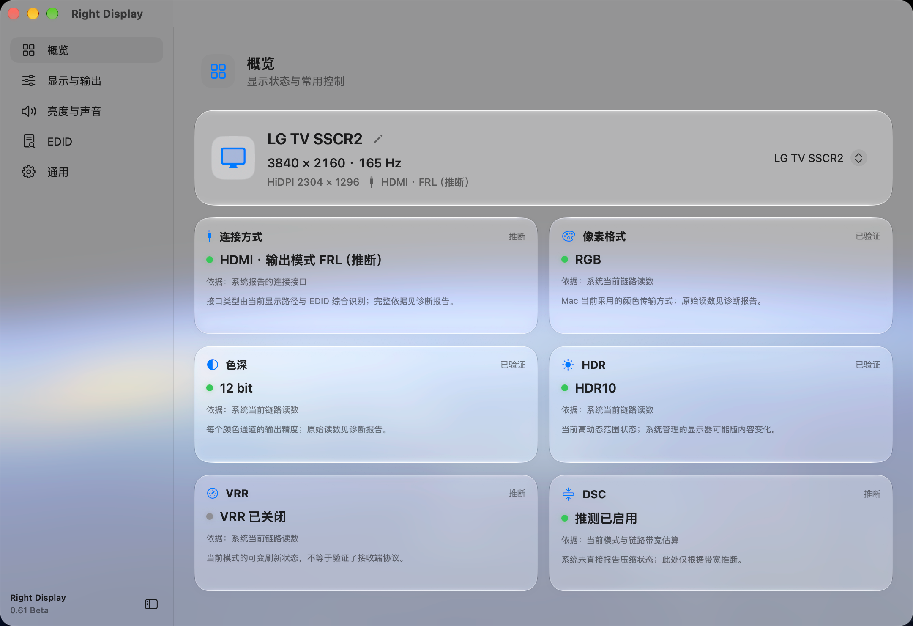
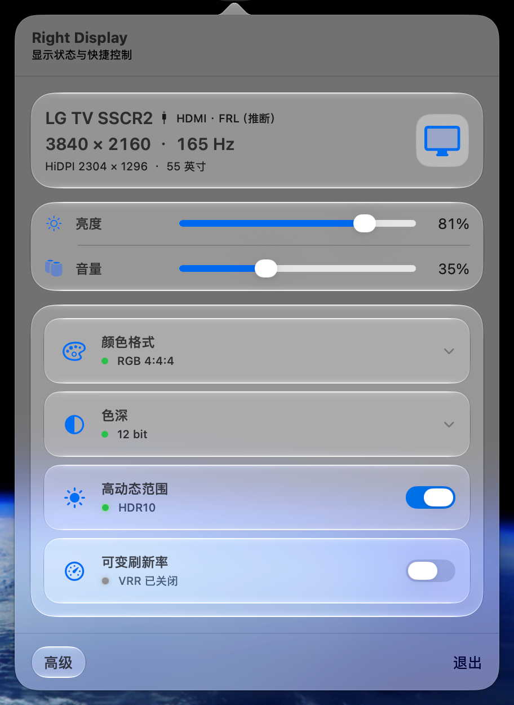
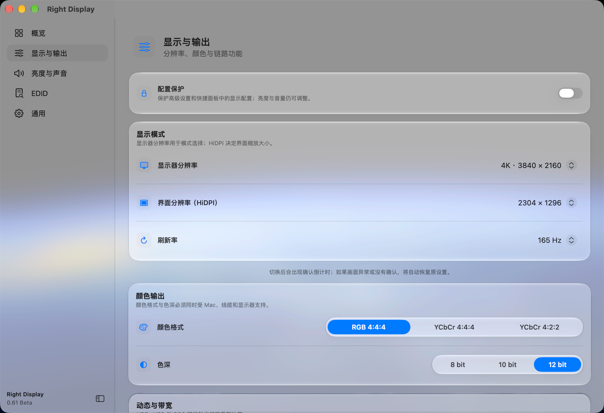
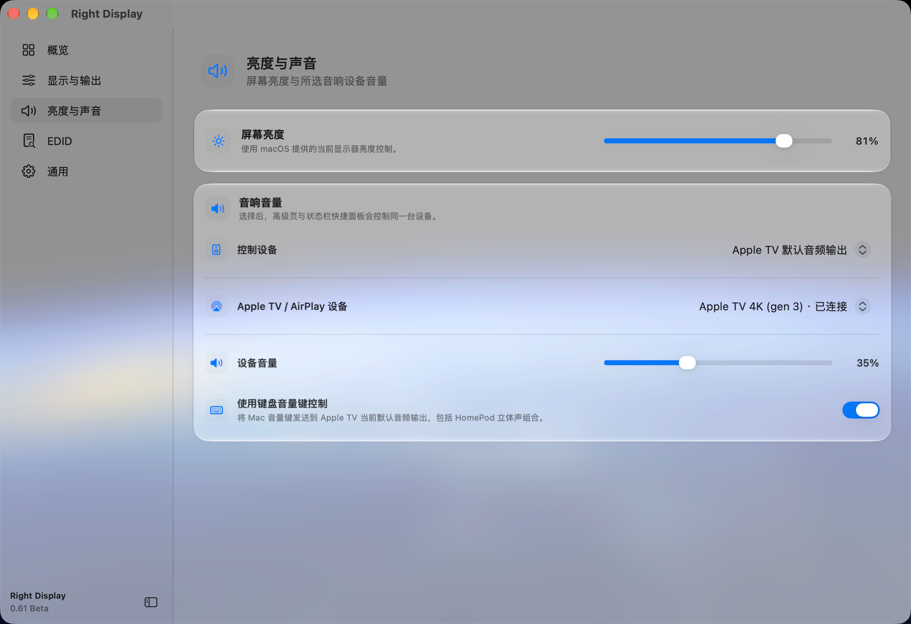

# RightDisplay

用于查看、解释、验证并安全调整 Mac 的显示链路。

[English](README.md) · [发行版本](https://github.com/RedoRosetta/RightDisplay/releases) · [版本历史](CHANGELOG.md)

**[下载 RightDisplay 0.3 Beta](https://github.com/RedoRosetta/RightDisplay/releases/tag/v0.3-beta)** · macOS 14+ · Apple 芯片 · Build 60。

## 界面一览

以下为 0.3 界面的开发预览。截图中的内部版本标识不代表独立公开发行版本；不是最终发行构建的实拍。

显示与输出 · 亮度与声音

## 看清显示器实际在做什么

RightDisplay 是面向外接显示器的 Mac 状态栏工具，将显示状态、可用控制与判断依据放在一起。

- **显示状态：** 输出时序、HiDPI 界面分辨率、刷新率、连接、颜色格式／色深及 HDR／VRR／DSC 证据。
- **显示链路测试：** 检查当前连接的稳定颜色格式、色深及 HDR／SDR 组合；测试可能中断画面，开始前需确认。
- **更安全的调整：** 支持的设置在操作后检查回读；需要确认的模式切换带倒计时，未确认时尝试恢复。不能保证所有连接均能成功恢复。
- **快捷控制：** 状态栏常用设置、亮度与音量，与高级设置共用真实状态。
- **亮度与声音：** 支持的显示器亮度、可写系统音频音量及兼容 Apple TV 的音频输出音量。HomePod 音量跟随 Apple TV 当前选择／默认输出，不承诺直接控制所有 HomePod 或 AirPlay 音箱；支持的路径可启用键盘音量键控制。
- **配置保护：** 锁定高级设置和快捷控制中的手动显示调整，亮度与音量仍可用；不是系统级安全隔离。
- **EDID 与诊断：** 解读、导出设备声明能力，保存本地诊断报告。

提供跟随系统／简体中文／English 界面语言、浅色／深色外观及首次使用引导。

## 区分证据，不把推断当事实

区分**当前回读／已验证**、**推断**与**设备声明能力**。EDID 不等于当前输出；DSC 及部分时序／传输信息属于推断，不是接收端实测。测试通过只覆盖当次连接与观察窗口。

## 系统要求

- 工程最低部署版本为 macOS 14，新系统视觉效果在旧系统上采用兼容表现。
- 当前已检查构建为 Apple 芯片 arm64，不承诺 Intel 发行包。
- 功能取决于 Mac、系统、显示器、转接器／扩展坞、线材和连接。
- Apple TV 需要兼容设备、网络及必要配对；相关功能可能需要本地网络或辅助功能权限，仅在使用时授予。

## 安装

RightDisplay 0.3 Beta 使用 **ad-hoc 签名，尚未经过 Apple 公证**。首次运行可能被 macOS 阻止：先正常打开；若被阻止，前往**系统设置 → 隐私与安全性 → 仍要打开**，或在系统提供此操作时从 Finder 手动选择**打开**。不需要关闭 Gatekeeper 或 SIP。

从[本次发行页](https://github.com/RedoRosetta/RightDisplay/releases/tag/v0.3-beta)下载 `RightDisplay-0.3-Beta.zip` 与 `SHA256SUMS.txt`，核对 SHA-256，解压并将 `Right Display.app` 放入“应用程序”。参见[安装说明](INSTALLATION.md)。

## 隐私与诊断

报告由用户主动保存到本地，不会自动提交 GitHub。包含显示／音频状态、系统和应用信息、近期操作及筛选的诊断摘录。结构化脱敏会排除部分标识和敏感字段，但不保证自由文本均匿名。分享前检查名称、错误信息与原始 EDID。参见[隐私说明](PRIVACY.md)。

## 当前限制

显示设置由系统与硬件协商，不能保证每个颜色／色深／HDR 请求均生效；缺少证据时保留未知。切换／测试可能短暂黑屏。恢复、网络重连和音量可用性因设备而异；Beta 兼容性以实际测试范围为准。

## 版本与反馈

查看 [0.3 更新说明](releases/0.3-beta.md)及[公开历史](CHANGELOG.md)。通过 [Issues](https://github.com/RedoRosetta/RightDisplay/issues) 提交可复现问题，先检查附件隐私。

本仓库仅提供发行材料，不公开自有应用源码。参见 [NOTICE](NOTICE.md) 与[第三方说明](THIRD_PARTY_LICENSES.md)。

## 支持开发

可自愿赞助支持开发。图片已移除外侧名称，原始二维码内容保持不变；支付平台仍可能在付款前显示收款方信息。

 

